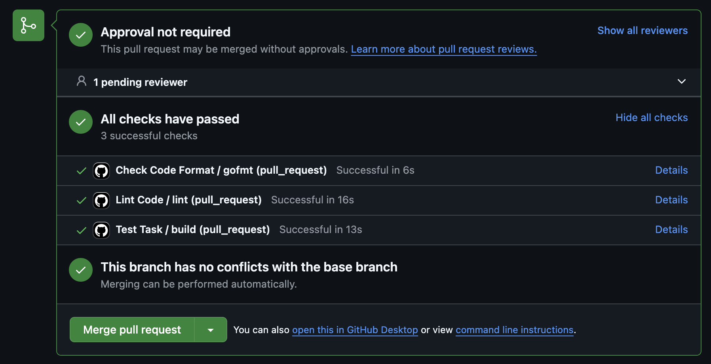
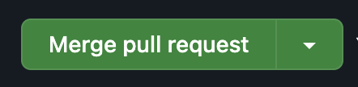

# learning-go

## Создание ветки с решением задачи
Ветка должна называться в формате пути до папки с задачей.
Пример - если решаешь задачу из папки `basic/helloworld`, то ветка
должна называться `basic/helloworld`

## Перед отправкой кода на проверку
Нужно проверить следующее:
1. Тесты проходят `go test -v`
2. Код отформатирован командой `gofmt -w main.go`
3. Код прошел линтинг командой `golangci-lint run main.go`

## После отправки
Убедиться, что все проверки прошли:

Если какая-то из проверок не прошла:
Исправить код, повторить действия 1-3

## После принятия задачи
Замержить код в ветку main, нажав кнопку
